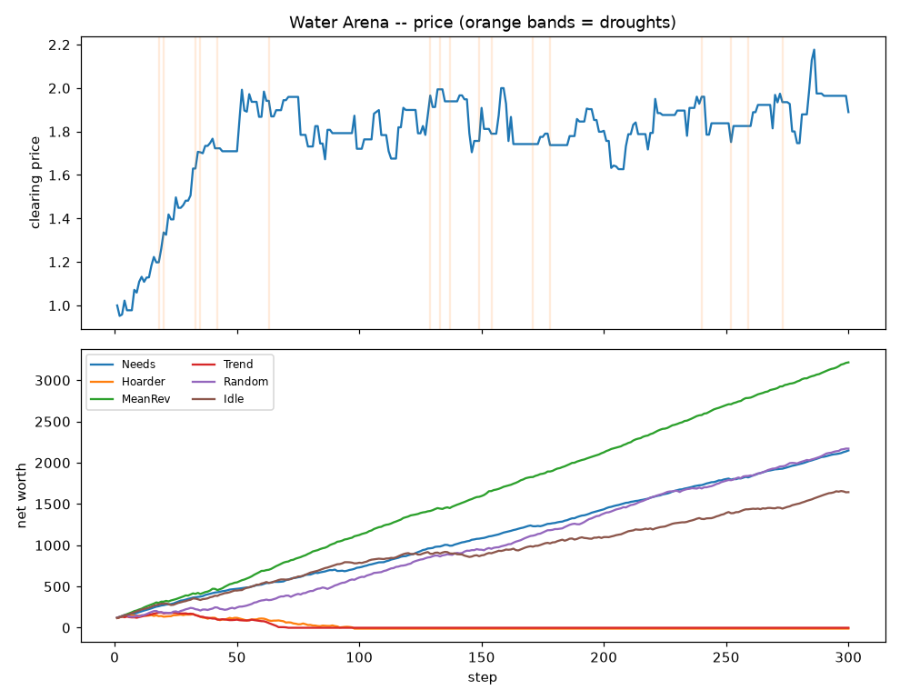

# 💧 Water Arena

A small economy-simulation arena for reinforcement-learning and scripted
strategies. **Water is the only traded good.** Agents own wells that produce
water, must consume water every step to earn revenue, and trade their
surpluses and deficits in a single-price call auction.

It's deliberately compact and dependency-light (the core engine is pure
standard library) so you can read the whole thing in an afternoon, drop in your
own strategy, and watch it compete.

```
rank  agent       status       net worth      cash   water   bought    sold   thirst
   1  MeanRev     alive          3216.91   3186.03   16.34     17.3   145.1    33.27
   2  Random      alive          2171.27   2171.27    0.00     69.4   313.1   268.81
   3  Needs       alive          2149.02   2137.13    6.29    362.7    24.9    72.96
   4  Idle        alive          1643.47   1643.47    0.00      0.0     0.0   298.83
   5  Trend       died@71          -0.52     -0.52    0.00     28.3     0.5   158.04
   6  Hoarder     died@98         -11.06    -11.06    0.00      5.9     0.0   216.52
```



## The model

Each agent has **cash**, a **water inventory** (capped by storage), and a
**well** whose capacity is fixed for the episode. Wells are *heterogeneous*:
some agents are structural producers (big wells, chronic surplus) and others
are consumers (small wells, chronic deficit). That asymmetry is what keeps
trade — and price — alive.

Every step runs six phases:

1. **Production** — each well produces water (`well_capacity × noise`), with the
   occasional market-wide **drought** slashing output. Storage caps the total.
2. **Decision** — every agent observes the world and submits an order
   (a limit price + a signed quantity: `> 0` buy, `< 0` sell).
3. **Market** — all orders clear at a single **uniform price** — the price that
   maximises traded volume. Better-priced orders fill first.
4. **Consumption** — each agent must consume its demand. Every unit consumed
   earns `consumption_value` in cash (you're a utility delivering water to
   end-users); unmet demand incurs a penalty.
5. **Spoilage** — a fraction of stored water evaporates.
6. **Accounting** — rewards (change in mark-to-market net worth) are recorded;
   agents whose cash goes negative go **bankrupt** and leave.

Because consumption produces value, the economy is **positive-sum** and price
settles near water's marginal value to buyers — but scarcity, droughts, storage
limits, and spoilage make *when* and *how much* to trade a real problem.

## Install & run

```bash
cd water-arena
python examples/tournament.py         # scripted-agent tournament + chart
python examples/custom_agent.py       # drop in your own strategy
python examples/rl_random_rollout.py  # the Gymnasium-style RL interface
pytest                                # run the test suite
```

The core engine needs **nothing but the standard library**. `numpy` is required
only for the RL env; `matplotlib` (optional) draws the chart; `gymnasium`
(optional) makes the RL env a true `gym.Env`.

```bash
pip install -r requirements.txt   # numpy, matplotlib, gymnasium (all optional)
```

## Writing a strategy

Subclass `Agent` and implement `act(observation) -> Action`:

```python
from water_arena import Agent, Action, World, WorldConfig, default_roster

class Undercut(Agent):
    def act(self, obs):
        reserve = obs.demand * 2                      # keep two steps in the tank
        surplus = obs.water - reserve
        if surplus > 0 and obs.last_price is not None:
            return Action(price=obs.last_price * 0.98, quantity=-surplus)  # sell
        if obs.water < obs.demand:
            return Action(price=obs.unit_value, quantity=obs.demand)       # buy
        return Action.hold()

world = World([Undercut(name="Me"), *default_roster()], WorldConfig(seed=0))
world.run()
print(world.summary())
```

The `Observation` gives you: `cash`, `water`, `well_capacity`,
`storage_capacity`, `demand`, `unit_value` (what a unit of water is worth to
you), `last_price`, and the full `price_history`. The simulation clips your
order to what you can actually afford and hold, so you can't cheat the budget.

## Reinforcement learning

`WaterTradingEnv` wraps the arena as a single-agent
[Gymnasium](https://gymnasium.farama.org/) environment — you control one agent,
scripted bots fill the rest:

```python
from water_arena.env import WaterTradingEnv

env = WaterTradingEnv()
obs, _ = env.reset(seed=0)
obs, reward, terminated, truncated, info = env.step([0.1, -0.5])  # price offset, size
```

- **Action** `[a0, a1]` in `[-1, 1]`: `a0` shifts your limit price around the
  reference (`price × (1 + 0.5·a0)`); `a1` sizes the order (fraction of storage
  headroom if buying, of held water if selling).
- **Observation** (7-vector): `cash, water, storage_headroom, demand,
  last_price, price_momentum, fraction_of_episode`.
- **Reward**: your change in mark-to-market net worth this step.

It follows the standard `reset`/`step` contract, so Stable-Baselines3, RLlib,
CleanRL, etc. plug in directly. If `gymnasium` isn't installed it still runs
with the same signatures and lightweight fallback spaces.

## Layout

```
water_arena/
  market.py   uniform-price call auction (pure stdlib)
  agents.py   Agent base class + scripted strategies + Observation/Action
  world.py    the World simulation: production, trade, consumption, accounting
  env.py      Gymnasium-style single-agent RL wrapper
examples/     tournament, custom agent, RL rollout
tests/        market + world invariants (pytest)
```

## Tuning the economy

Everything lives in `WorldConfig` — well capacity and spread, drought
probability, demand, consumption value, spoilage, storage, the bankruptcy rule,
and the seed. Crank `drought_prob` for a harsher world, widen
`well_capacity_spread` to sharpen the producer/consumer divide, or drop
`consumption_value` to squeeze margins.

## Ideas / next steps

- Multi-agent RL via a PettingZoo `ParallelEnv` wrapper
- Well investment: spend cash to expand capacity (capital dynamics)
- Futures / storage arbitrage across drought cycles
- Regional markets with transport cost between them
