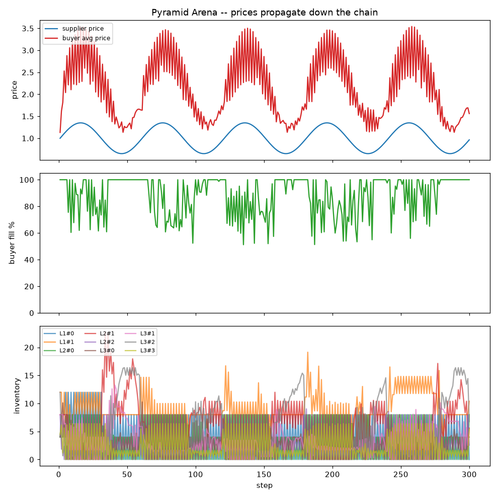
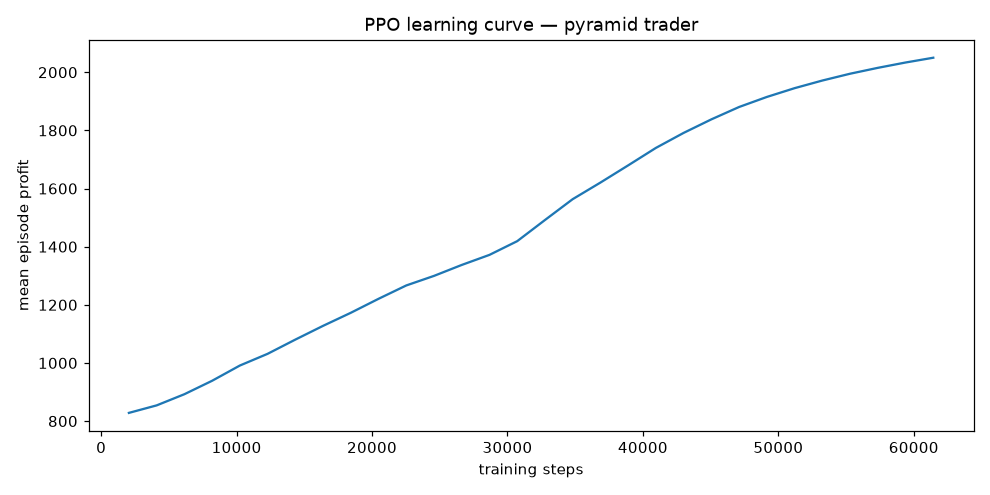

# 💧 Water Arena

A small economy-simulation arena for reinforcement-learning and scripted
strategies. **Water is the only traded good.** It ships with two models:

- **Flat market** — agents own wells, consume water to earn revenue, and trade
  surpluses/deficits in a single-price call auction. *(jump to
  [Pyramid supply chain](#pyramid-supply-chain-the-network-model) for the other.)*
- **Pyramid supply chain** — water flows down a Pascal's-triangle network from a
  single supplier through capacity-limited pipelines and reseller middlemen to a
  final buyer that shops cheapest-first.

It's deliberately compact and dependency-light (the core engine is pure
standard library) so you can read the whole thing in an afternoon, drop in your
own strategy, and watch it compete.

```
rank  agent       status       net worth      cash   water   bought    sold   thirst
   1  MeanRev     alive          3216.91   3186.03   16.34     17.3   145.1    33.27
   2  Random      alive          2171.27   2171.27    0.00     69.4   313.1   268.81
   3  Needs       alive          2149.02   2137.13    6.29    362.7    24.9    72.96
   4  Idle        alive          1643.47   1643.47    0.00      0.0     0.0   298.83
   5  Trend       died@71          -0.52     -0.52    0.00     28.3     0.5   158.04
   6  Hoarder     died@98         -11.06    -11.06    0.00      5.9     0.0   216.52
```


## The model

Each agent has **cash**, a **water inventory** (capped by storage), and a
**well** whose capacity is fixed for the episode. Wells are *heterogeneous*:
some agents are structural producers (big wells, chronic surplus) and others
are consumers (small wells, chronic deficit). That asymmetry is what keeps
trade — and price — alive.

Every step runs six phases:

1. **Production** — each well produces water (`well_capacity × noise`), with the
   occasional market-wide **drought** slashing output. Storage caps the total.
2. **Decision** — every agent observes the world and submits an order
   (a limit price + a signed quantity: `> 0` buy, `< 0` sell).
3. **Market** — all orders clear at a single **uniform price** — the price that
   maximises traded volume. Better-priced orders fill first.
4. **Consumption** — each agent must consume its demand. Every unit consumed
   earns `consumption_value` in cash (you're a utility delivering water to
   end-users); unmet demand incurs a penalty.
5. **Accounting** — rewards (change in mark-to-market net worth) are recorded;
   agents whose cash goes negative go **bankrupt** and leave.

Because consumption produces value, the economy is **positive-sum** and price
settles near water's marginal value to buyers — but scarcity, droughts, and
storage limits make *when* and *how much* to trade a real problem.

## Install & run

```bash
cd water-arena
python examples/tournament.py         # scripted-agent tournament + chart
python examples/custom_agent.py       # drop in your own strategy
python examples/rl_random_rollout.py  # the Gymnasium-style RL interface
pytest                                # run the test suite
```

The core engine needs **nothing but the standard library**. `numpy` is required
only for the RL env; `matplotlib` (optional) draws the chart; `gymnasium`
(optional) makes the RL env a true `gym.Env`.

```bash
pip install -r requirements.txt   # numpy, matplotlib, gymnasium (all optional)
```

## Writing a strategy

Subclass `Agent` and implement `act(observation) -> Action`:

```python
from water_arena import Agent, Action, World, WorldConfig, default_roster

class Undercut(Agent):
    def act(self, obs):
        reserve = obs.demand * 2                      # keep two steps in the tank
        surplus = obs.water - reserve
        if surplus > 0 and obs.last_price is not None:
            return Action(price=obs.last_price * 0.98, quantity=-surplus)  # sell
        if obs.water < obs.demand:
            return Action(price=obs.unit_value, quantity=obs.demand)       # buy
        return Action.hold()

world = World([Undercut(name="Me"), *default_roster()], WorldConfig(seed=0))
world.run()
print(world.summary())
```

The `Observation` gives you: `cash`, `water`, `well_capacity`,
`storage_capacity`, `demand`, `unit_value` (what a unit of water is worth to
you), `last_price`, and the full `price_history`. The simulation clips your
order to what you can actually afford and hold, so you can't cheat the budget.

## Reinforcement learning

`WaterTradingEnv` wraps the arena as a single-agent
[Gymnasium](https://gymnasium.farama.org/) environment — you control one agent,
scripted bots fill the rest:

```python
from water_arena.env import WaterTradingEnv

env = WaterTradingEnv()
obs, _ = env.reset(seed=0)
obs, reward, terminated, truncated, info = env.step([0.1, -0.5])  # price offset, size
```

- **Action** `[a0, a1]` in `[-1, 1]`: `a0` shifts your limit price around the
  reference (`price × (1 + 0.5·a0)`); `a1` sizes the order (fraction of storage
  headroom if buying, of held water if selling).
- **Observation** (7-vector): `cash, water, storage_headroom, demand,
  last_price, price_momentum, fraction_of_episode`.
- **Reward**: your change in mark-to-market net worth this step.

It follows the standard `reset`/`step` contract, so Stable-Baselines3, RLlib,
CleanRL, etc. plug in directly. If `gymnasium` isn't installed it still runs
with the same signatures and lightweight fallback spaces.

## Pyramid supply chain (the network model)

The flat arena above is a single spot market. The **pyramid** model
(`water_arena.pyramid`) is a different beast: water flows *down a network*
shaped like Pascal's triangle.

```
              Supplier            layer 0  (posts a price)
             /        \
          L1#0        L1#1        layer 1  (2 traders)
         /    \      /    \
      L2#0    L2#1(shared) L2#2   layer 2  (3 traders)
      ...  each node feeds children i and i+1; the middle child is shared ...
               |
             Buyer                fills a need cheapest-first, up to a WTP cap
```

- A single **supplier** at the apex posts a price (constant, sine, or random
  walk) and has effectively unlimited water.
- Below it, trader layers grow **2, 3, 4, …** (`n_layers`, default 3). Node *i*
  in a layer feeds children *i* and *i+1* below, so adjacent traders **share the
  middle child**. Every edge is a **pipeline with a maximum flow rate**.
- Each **trader** is a middleman with inventory + cash. Each step it posts a
  **sell price** to its children and **orders** replenishment from its parent(s)
  — bounded by pipeline capacity, cash, and storage. Purchases arrive with a
  **one-step lead time**, so stocking and pricing under uncertainty is the core
  decision (this is what drives the bullwhip effect you'll see in the charts).
- At the bottom, a single **buyer** fills a per-step **need** by taking the
  **cheapest** water on offer first, up to a **willingness-to-pay** cap. That
  price competition propagates scarcity signals back up the pyramid.

```bash
python examples/pyramid_run.py     # tournament on the pyramid + chart
```



Prices amplify and stack as they flow down (supplier ~0.65–1.35 → buyer
~1.0–3.5), fill rate dips mark scarcity events, and inventories saw-tooth from
base-stock ordering.

### Writing a trader

Subclass `SupplyAgent`; return a `SupplyAction` — a sell price plus a
`{parent_id: quantity}` order map:

```python
from water_arena import SupplyAgent, SupplyAction, PyramidWorld, PyramidConfig
from water_arena import build_pyramid, default_supply_roster

class ThinMargin(SupplyAgent):
    def act(self, obs):
        cost = obs.cheapest_parent_price
        price = cost * 1.05                      # undercut to win the buyer
        # order up to ~3 steps of recent demand from the cheapest parent
        target = 3 * max(obs.last_sold, 2.0)
        deficit = max(0.0, target - obs.inventory)
        cheapest = min(obs.parent_prices, key=obs.parent_prices.get)
        cap = obs.parent_capacities[cheapest]
        return SupplyAction(sell_price=price, orders={cheapest: min(deficit, cap)})

cfg = PyramidConfig(n_layers=3, seed=0)
topo = build_pyramid(cfg.n_layers, cfg.pipeline_capacity)
roster = default_supply_roster(topo.trader_ids)
roster[topo.bottom_ids[0]] = ThinMargin(name="Me")   # take over one bottom node
world = PyramidWorld(roster, cfg)
world.run()
print(world.summary())
```

The `SupplyObservation` gives you `inventory`, `cash`, `storage_headroom`,
`last_sold` (your demand signal), `supplier_price`, your parents' `parent_prices`
and `parent_capacities`, your `child_capacities`, and — for bottom nodes — the
buyer's `buyer_willingness_to_pay`.

**Built-in strategies.** Basic — `CostPlusTrader`, `Discounter`, `Monopolist`,
`Speculator`, `RandomTrader`. Advanced:

| strategy | idea |
|---|---|
| `EWMAReplenisher` | forecast demand (EWMA) + smoothed base-stock ordering — damps the bullwhip effect |
| `AdaptivePricer` | feedback controller: raises margin when it sells through, cuts it when stock piles up |
| `InventoryAwarePricer` | surge pricing off its own stock — premium when scarce, discount when full |
| `JustInTimeTrader` | lean: near-zero inventory, thin margin, minimal holding cost (stocks out on spikes) |
| `BanditPricer` | epsilon-greedy multi-armed bandit over markups, learning online from realised profit |

`default_supply_roster` mixes all of them across the nodes; `advanced_supply_roster`
pits only the advanced ones head-to-head. The `BanditPricer` is a handy baseline
for RL: a policy that can't beat a bandit hasn't learned much.

### Other ways the bottom could sell

The cheapest-first buyer is the default because it's simple and creates clean
price competition, but the interface supports alternatives — a **uniform-price
auction** among bottom sellers (reuse `water_arena.market.clear_market`),
**multiple buyers** with different needs/WTP, **elastic demand** (need falls as
price rises), or **contracts** (a buyer commits to a seller for N steps). Say the
word and I'll wire one in.

### Position matters

Node *i* feeds children *i* and *i+1*, so a **corner** trader has only one parent
pipeline — half the inflow of an interior node, no choice of supplier, and a
single point of failure. With identical agents on every node, interior traders
out-earn corners by ~70%, and the gap compounds down the edges. This is a real,
intentional feature of the geography: where you sit in the network is part of
the problem. (If you want to control for it, evaluate an agent against the same
strategy in the same position rather than comparing absolute profit.)

### Prices along the chain

`world.price_cascade()` returns the volume-weighted average price at each stage
(supplier → each layer → what the buyer pays); `world.price_cascade_str()` prints
it. Margins stack multiplicatively down the chain — with every node on a +25 %
cost-plus rule you get a clean `1 → 1.25 → 1.56 → 1.95×` cascade.

### Reinforcement learning (pyramid)

`PyramidTradingEnv` wraps the supply chain as a single-agent Gymnasium env — you
control **one trader node**, scripted strategies fill the rest:

```python
from water_arena.pyramid_env import PyramidTradingEnv
from water_arena.pyramid import PyramidConfig

env = PyramidTradingEnv(config=PyramidConfig(n_layers=3), learner_node=None)  # default: interior bottom node
obs, _ = env.reset(seed=0)
obs, reward, terminated, truncated, info = env.step([0.3, 0.5])  # [markup knob, target-stock knob]
```

- **Action** `[a0, a1]` in `[-1, 1]`: `a0` sets the markup over input cost
  (`0 … markup_cap`); `a1` sets a target inventory (`0 … storage`) that's ordered
  cheapest-parent-first within pipeline/cash limits.
- **Observation** (9-vector): inventory, cash, input cost, last sell price, last
  sold (demand), supplier price, buyer WTP, is-bottom flag, episode progress.
- **Reward**: the node's profit that step (its change in cash).
- Pick any seat with `learner_node`; the rest run `default_supply_roster`, or pass
  your own `opponents`. `examples/rl_pyramid_rollout.py` runs a random policy and
  compares it to a scripted baseline in the same seat.
- An explicit `reset(seed=s)` gives an exact, reproducible episode; an auto-reset
  (`seed=None`, as during training) draws a fresh world each episode so the policy
  sees variety.

**Train one (Stable-Baselines3).** `examples/rl_train_sb3.py` trains a PPO agent
and evaluates it against a random policy and a cost-plus baseline in the same seat
on the same held-out worlds:

```bash
pip install stable-baselines3          # pulls torch; CPU is fine
python examples/rl_train_sb3.py --timesteps 60000
```

```
Mean episode profit over 30 held-out worlds:
  random policy       871.75
  cost-plus baseline  214.49
  trained PPO        2784.02      # learns to price into the cheapest-first buyer
```



## Layout

```
water_arena/
  market.py         uniform-price call auction (pure stdlib)
  agents.py         flat-arena Agent base + scripted strategies
  world.py          flat-arena World: production, trade, consumption
  env.py            Gymnasium-style single-agent RL wrapper (flat arena)
  pyramid.py        pyramid topology + supply-chain simulation + buyer
  supply_agents.py  scripted trader strategies (basic + advanced) for the pyramid
  pyramid_env.py    Gymnasium-style single-agent RL wrapper (pyramid)
examples/           tournament, custom agent, RL rollouts, pyramid_run,
                    advanced_showdown, typical_round, rl_train_sb3
tests/              market + world + pyramid + RL-env invariants (pytest)
```

## Tuning the economy

Everything lives in `WorldConfig` — well capacity and spread, drought
probability, demand, consumption value, storage, the bankruptcy rule,
and the seed. Crank `drought_prob` for a harsher world, widen
`well_capacity_spread` to sharpen the producer/consumer divide, or drop
`consumption_value` to squeeze margins.

## Ideas / next steps

- Multi-agent RL via a PettingZoo `ParallelEnv` wrapper
- Well investment: spend cash to expand capacity (capital dynamics)
- Futures / storage arbitrage across drought cycles
- Regional markets with transport cost between them
